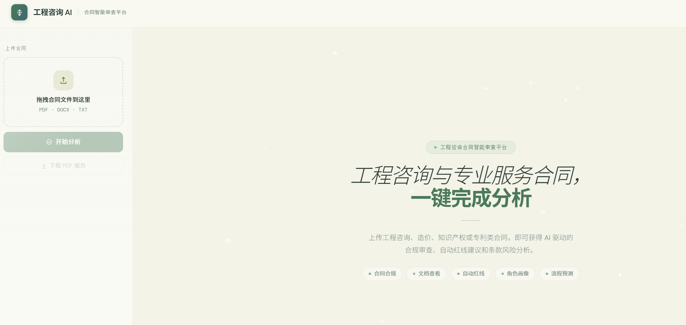
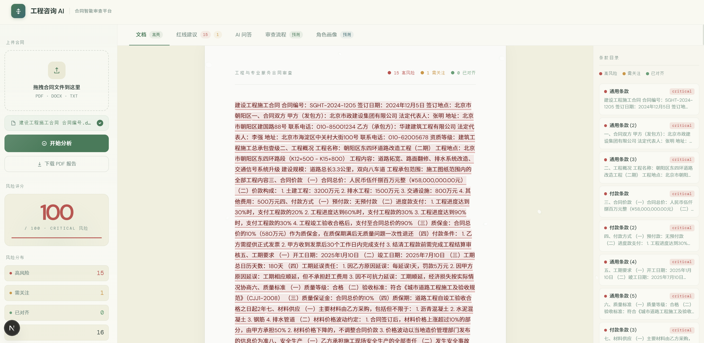
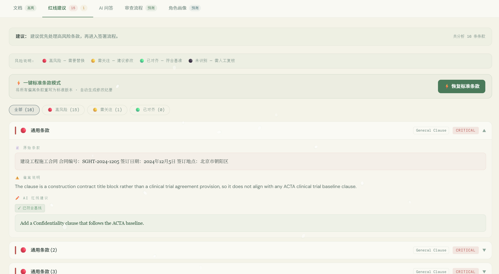
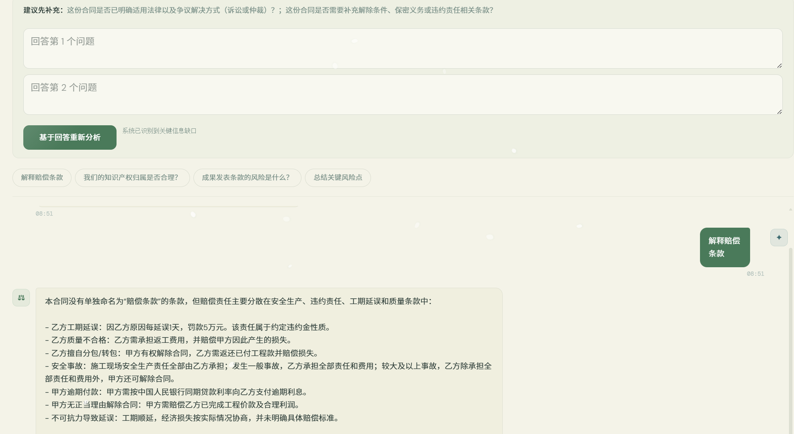
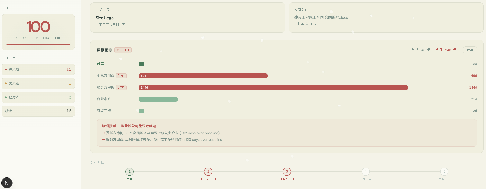
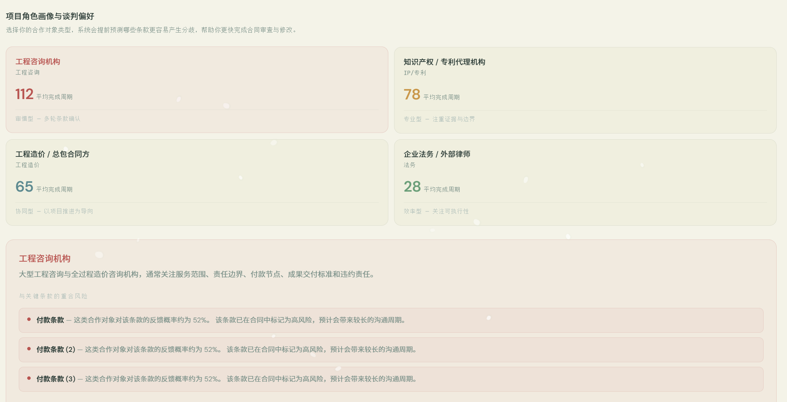

# Contract Review AI

A portfolio-ready full-stack AI contract review platform built for engineering consulting and professional service agreements.
It helps users upload contracts, extract text, identify risks, generate redline suggestions, and continue the review with interactive follow-up questions.

## 项目简介

这是一个面向工程咨询、专业服务、知识产权等合同场景的 AI 智能审查平台。
系统支持上传合同文件后自动解析文本、识别条款风险、生成红线建议，并提供交互式问答、流程预测和角色画像分析，帮助用户更快理解合同内容并发现潜在问题。

This project is designed to make contract review faster, clearer, and more explainable for both technical and non-technical reviewers.

## Why this project stands out

- **End-to-end workflow** from file upload to PDF export
- **Fast, explainable analysis** with rule-based screening and LLM-assisted review
- **Interactive follow-up** so users can ask questions and re-run analysis with extra context
- **Portfolio-friendly UI** with a polished dashboard, document viewer, and workflow views
- **Real-world contract focus** covering engineering consulting and professional service agreements

## Screenshots

### 1. Home Dashboard


上传入口与核心功能概览集中展示，用户可以快速开始合同审查流程，并直观看到平台支持的主要分析能力。

### 2. Document Analysis View


上传合同后，系统会自动解析文本并高亮关键信息，同时给出风险评分、条款分布和可视化摘要，帮助用户快速定位重点内容。

### 3. Redline Recommendations


系统会针对高风险条款生成红线建议与修改方向，帮助用户快速理解哪里有问题，以及应该如何调整条款。

### 4. AI Q&A Assistant


用户可以围绕合同内容继续追问，系统会结合当前合同上下文进行回答，适合进一步确认条款含义、风险点和修改思路。

### 5. Review Workflow Timeline


系统会展示审查流程与阶段性结果，帮助用户了解当前分析进度，并预测后续审查和协商的重点步骤。

### 6. Persona & Negotiation Preference Insights


根据合作对象类型，系统会提前预测对方更可能关注或争议的条款，帮助用户更快制定审查和谈判策略。

## 核心功能

- 合同文件上传与解析，支持 PDF / DOCX / TXT
- AI 条款审查与风险分级
- 红线建议与合同修订提示
- 可视化文档浏览与条款跳转
- 交互式 AI 问答与补充追问
- 审查流程预测与角色画像分析
- PDF 报告导出

## 技术栈

### Frontend
- Next.js 16
- React 19
- TypeScript
- Tailwind CSS
- Client-side UI state and interactive document views

### Backend
- FastAPI
- Python 3.12
- LangGraph / LangChain
- Pydantic
- PyPDF2 / PyMuPDF / python-docx
- ReportLab for PDF export

### Other
- File upload and document parsing pipeline
- Risk scoring and recommendation engine
- Contract analysis workflow orchestration

## 项目亮点

- **端到端全流程**：从文件上传、文本解析到风险识别、建议生成与报告导出，一次完成
- **面试友好**：每个分析结果都可解释，方便展示思路而不是只展示结论
- **交互性强**：用户可针对系统追问继续补充信息并重新分析
- **适合真实业务场景**：覆盖工程咨询和专业服务合同中的高频审查需求

## 本地运行

### 1. 启动后端

```powershell
cd python
.\venv\Scripts\python.exe -m uvicorn src.api.main:app --host 0.0.0.0 --port 8000
```

如果你使用的是系统 Python，可以改成：

```powershell
cd python
python -m uvicorn src.api.main:app --host 0.0.0.0 --port 8000
```

### 2. 启动前端

```powershell
cd frontend
npm install
npm run dev
```

前端默认运行在 `http://localhost:3000`

## 目录结构

```text
frontend/   # Next.js 前端
python/     # FastAPI + AI 分析后端
```

## 后续可优化方向

- 增加更多合同类型模板
- 优化风险规则库
- 支持多语言合同
- 增加用户登录和历史记录保存
- 加入更丰富的可视化图表

## License

This project is for portfolio and demonstration purposes unless otherwise specified.
